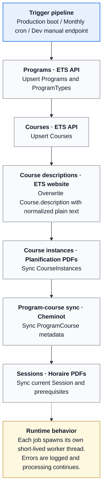
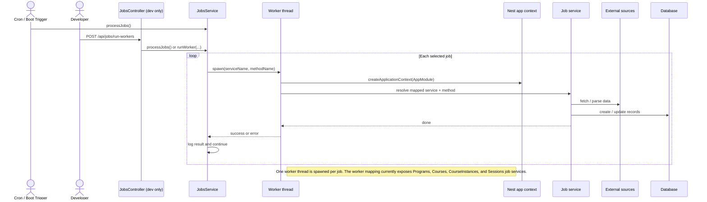

# Jobs Pipeline

This pipeline keeps PlanifETS academic data in sync with external ETS sources. The goal of this page is to document the orchestration at a high level.

## When it runs

- Production boot: `runOnceAfterBoot()` starts the full pipeline 30 seconds after startup.
- Monthly schedule: `processJobs()` runs on the first day of each month at midnight (`America/Toronto`).
- Development only: `POST /api/jobs/run-workers` can run the full pipeline or selected jobs manually.

## Execution model

- The pipeline is coordinated by `JobsService`.
- Jobs run sequentially in a fixed order.
- Each job spawns its own short-lived worker thread through `jobRunner.worker.ts`.
- A failure is logged, but the pipeline continues with the next job.

## Current order

| Step | Job | Main source | Main outcome |
| --- | --- | --- | --- |
| 1 | `ProgramsJobService.processPrograms` | ETS API | Upserts program types and programs |
| 2 | `CoursesJobService.processCourses` | ETS API | Upserts courses |
| 3 | `CoursesJobService.syncCourseDescriptionsFromEtsWebsite` | ETS website | Overwrites course descriptions with normalized plain text |
| 4 | `CourseInstancesJobService.processCourseInstances` | Planification PDFs | Syncs course instances |
| 5 | `CoursesJobService.syncCourseDetailsWithCheminotData` | Cheminot | Syncs program-course metadata |
| 6 | `SessionsJobService.processSessions` | Horaire PDFs | Syncs the current session and prerequisites |

## Pipeline flow

## Worker execution

