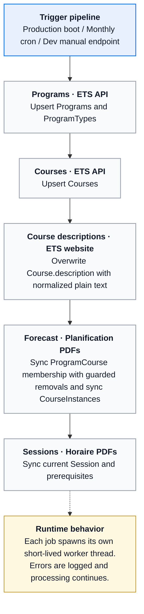
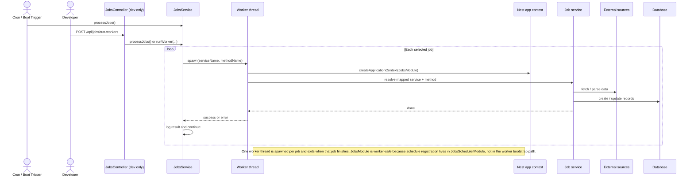

# Jobs Pipeline

This pipeline keeps PlanifETS academic data in sync with external ETS sources. The goal of this page is to document the orchestration at a high level.

## When it runs

- Production boot: `runOnceAfterBoot()` starts the full pipeline 30 seconds after startup.
- Monthly schedule: `processJobs()` runs on the first day of each month at midnight (`America/Toronto`).
- Development only: `POST /api/jobs/run-workers` can run the full pipeline or selected jobs manually.

## Execution model

- The pipeline is coordinated by `JobsService`.
- Jobs run sequentially in a fixed order.
- Each job spawns its own short-lived worker thread through `jobRunner.worker.ts`.
- Workers bootstrap `JobsModule` directly.
- Scheduler registration stays in `JobsSchedulerModule`, which is only imported by the main app.
- A failure is logged, but the pipeline continues with the next job.

## Current order

| Step | Job | Main source | Main outcome |
| --- | --- | --- | --- |
| 1 | `ProgramsJobService.processPrograms` | ETS API | Upserts program types and programs |
| 2 | `CoursesJobService.processCourses` | ETS API | Upserts courses |
| 3 | `CoursesJobService.syncCourseDescriptionsFromEtsWebsite` | ETS website | Overwrites course descriptions with normalized plain text |
| 4 | `CourseInstancesJobService.processCourseInstances` | Planification forecast PDFs | Syncs program-course membership (guarded removals) and course instances |
| 5 | `SessionsJobService.processSessions` | Horaire PDFs | Syncs the current session and prerequisites |
| 6 | `CourseEmbeddingIndexerService.run` | Course data | Indexes embeddings when chatbot is enabled |

## Pipeline flow

```mermaid
flowchart TD
    T["<b>Trigger pipeline</b><br/><span style='color:#6B7280'>Production boot / Monthly cron / Dev manual endpoint</span>"]

    P["<b>Programs · ETS API</b><br/><span style='color:#6B7280'>Upsert Programs and ProgramTypes</span>"]
    C["<b>Courses · ETS API</b><br/><span style='color:#6B7280'>Upsert Courses</span>"]
    D["<b>Course descriptions · ETS website</b><br/><span style='color:#6B7280'>Overwrite Course.description with normalized plain text</span>"]
    I["<b>Forecast · Planification PDFs</b><br/><span style='color:#6B7280'>Sync ProgramCourse membership with guarded removals and sync CourseInstances</span>"]
    S["<b>Sessions · Horaire PDFs</b><br/><span style='color:#6B7280'>Sync current Session and prerequisites</span>"]

    N["<b>Runtime behavior</b><br/><span style='color:#6B7280'>Each job spawns its own short-lived worker thread.<br/>Errors are logged and processing continues.</span>"]

    T --> P --> C --> D --> I --> S
    S -.-> N

    classDef trigger fill:#E8F0FE,stroke:#1A73E8,color:#111827,stroke-width:1.5px;
    classDef step fill:#F9FAFB,stroke:#9CA3AF,color:#111827,stroke-width:1.5px;
    classDef note fill:#FFF8E1,stroke:#B07D00,color:#111827,stroke-width:1px;

    class T trigger;
    class P,C,D,I,S step;
    class N note;
```

## Worker execution

```mermaid
sequenceDiagram
    actor Trigger as Cron / Boot Trigger
    actor Dev as Developer
    participant Controller as JobsController (dev only)
    participant Jobs as JobsService
    participant Worker as Worker thread
    participant App as Nest app context
    participant Service as Job service
    participant Sources as External sources
    participant DB as Database

    Trigger->>Jobs: processJobs()
    Dev->>Controller: POST /api/jobs/run-workers
    Controller->>Jobs: processJobs() or runWorker(...)

    loop Each selected job
        Jobs->>Worker: spawn(serviceName, methodName)
        Worker->>App: createApplicationContext(JobsModule)
        Worker->>Service: resolve mapped service + method
        Service->>Sources: fetch / parse data
        Service->>DB: create / update records
        Service-->>Worker: done
        Worker-->>Jobs: success or error
        Jobs->>Jobs: log result and continue
    end

    Note right of Worker: One worker thread is spawned per job and exits when that job finishes. JobsModule is worker-safe because schedule registration lives in JobsSchedulerModule, not in the worker bootstrap path.
```

Note that the current implementation uses one short-lived worker per job.

Workers send explicit `{ status: 'success', result }` or `{ status: 'error', error }` messages. Reported errors, nonzero exits and exits without a valid result reject the worker promise. Only the first terminal event settles it; failures are logged as failures and the next job still runs.
